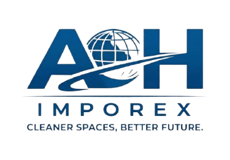

# A & H Imporex Website

## Company Information

**Company Name:** A & H Imporex  
**Motto:** "Cleaner Space. Better Future."  
**Location:** 48 Big Waterloo Street, Freetown, Sierra Leone  
**Email:** imporexah@gmail.com  
**Phone Numbers:**
- 075544243
- 034000832
- 078581700

---

## About A & H Imporex

A & H Imporex is a leading cleaning and waste management company committed to providing exceptional services that create cleaner spaces and build a better future. We specialize in comprehensive solutions for residential, commercial, and industrial clients.

---

## Services Offered

1. **Waste Collection & Disposal** - Efficient and environmentally responsible waste management
2. **Cleaning & Janitorial Services** - Office cleaning, facility maintenance, and professional janitorial services
3. **Waste Management Solutions** - Integrated strategies to optimize efficiency and reduce environmental impact
4. **Health & Safety Environment** - Compliance with health and safety standards ensuring clean, safe environments
5. **Training & Mentoring** - Professional development programs for staff in cleaning and waste management
6. **Consulting Services** - Expert consultation on waste management systems and environmental best practices

---

## Website Features

### Design
- **Color Scheme:** Professional Blue (#0066cc) and White design
- **Responsive:** Fully responsive design that works on desktop, tablet, and mobile devices
- **Modern UI:** Clean, professional interface with smooth animations and transitions

### Sections
1. **Navigation Bar** - Sticky navigation for easy access to all sections
2. **Hero Section** - Eye-catching banner with company motto and call-to-action
3. **Services Section** - Showcase of all services with icons and descriptions
4. **About Section** - Company mission and values
5. **Contact Section** - Multiple contact methods and inquiry form
6. **Footer** - Company information and motto

---

## Files Structure

```
AandH/
├── index.html          # Main website page
├── css/
│   └── styles.css      # Main stylesheet (Blue & White theme)
├── js/
│   └── main.js         # JavaScript for interactivity
├── assets/             # Folder for images and media
└── README.md           # This file
```

---

## How to Use

### Opening the Website
1. Open the `index.html` file in any web browser
2. Use the navigation menu to browse different sections
3. Click "Get in Touch" to go to the contact section

### Customization

#### Changing Colors
Edit the CSS variables in `css/styles.css`:
```css
:root {
    --primary-blue: #0066cc;
    --dark-blue: #004399;
    --light-blue: #e6f2ff;
    --white: #ffffff;
}
```

#### Adding Company Logo
Place your logo image in the `assets/` folder and update the HTML:
```html
<div class="logo">
    
</div>
```

#### Contact Form
The contact form is ready to receive submissions. To make it fully functional, connect it to a backend service or email service like:
- Formspree
- EmailJS
- Your own backend API

---

## Browser Compatibility

- Chrome (Latest)
- Firefox (Latest)
- Safari (Latest)
- Edge (Latest)
- Mobile browsers (iOS Safari, Chrome Mobile)

---

## Features

✅ Fully Responsive Design  
✅ Smooth Scrolling Navigation  
✅ Service Cards with Hover Effects  
✅ Professional Contact Form  
✅ Optimized for Mobile Devices  
✅ Fast Loading Performance  
✅ SEO-Friendly Structure  
✅ Accessible Design (WCAG Compliant)

---

## Contact Information

For inquiries or to modify the website:

📧 Email: imporexah@gmail.com  
📞 Phone: 075544243 / 034000832 / 078581700  
📍 Address: 48 Big Waterloo Street, Freetown, Sierra Leone

---

## Version

**Current Version:** 1.0  
**Last Updated:** May 13, 2026

---

## Notes

- The website uses Font Awesome icons (loaded via CDN)
- JavaScript includes smooth scrolling and form validation
- All content is mobile-responsive with proper breakpoints
- The design follows modern web standards and best practices
